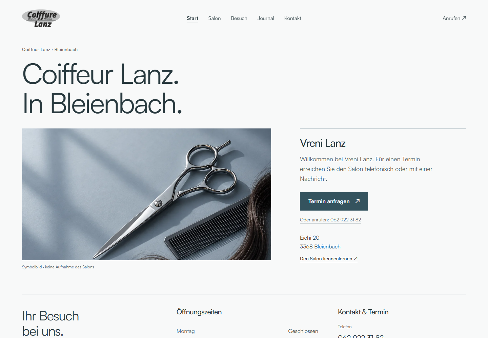
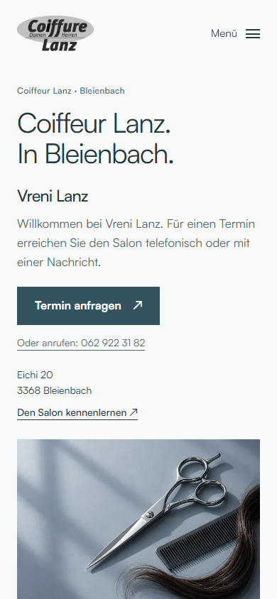

# Lanz: archivierte Browserbelege

Diese Bilder wurden am 22. September 2026 bei den dokumentierten lokalen Browserprüfungen erzeugt. Die Nachher-Bilder zeigen die gewählte Richtung B mit isolierten Testdaten. Es handelt sich um öffentliche Seiten, nicht um Verwaltungszugänge oder eine neue Live-Abnahme.

| Einstieg | Vorher | Richtung B |
|---|---|---|
| Desktop 1440 × 1000 | [Vorher](lanz-before/desktop-entry.png) | [Nachher](lanz-direction-b/home-1440-entry.png) |
| Mobil 390 × 844 | [Vorher](lanz-before/mobile-entry.png) | [Nachher](lanz-direction-b/home-390-entry.png) |

[Alle gespeicherten Ansichten und Prüfergebnisse](lanz-direction-b/). Die Bilder wurden ohne Bildbearbeitung aus den dokumentierten Arbeitsverzeichnissen kopiert. Hinweise zu Testinhalten und Grenzen stehen im [Umsetzungsbericht](../../clients/coiffeur-lanz/DESIGN-B-UMSETZUNG.md).

## Desktop

## Mobil

